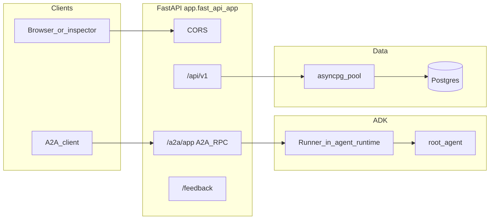

# Architecture

## Overview

The process is a **FastAPI** app (`app.fast_api_app:app`) that:

1. On **lifespan startup**, creates an **asyncpg** pool, builds a dynamic **A2A Agent Card**, mounts **A2A** HTTP routes, and registers REST routes under `/api/v1`.
2. Serves **A2A JSON-RPC** for the ADK app named `app` (see `App(name="app")` in [`app/agent.py`](../app/agent.py)), at paths derived from `/a2a/{app_name}/…` (e.g. agent card and RPC).
3. Exposes a small **REST API** for authenticated users (Clerk JWT) backed by **Postgres** repositories.

Telemetry is initialized at import time via [`app/app_utils/telemetry.py`](../app/app_utils/telemetry.py).

## Diagram

## Startup and shutdown

[`app/fast_api_app.py`](../app/fast_api_app.py) `lifespan`:

- Calls `create_pool(settings)` from [`app/db/pool.py`](../app/db/pool.py).
- Builds `AgentCard` via `AgentCardBuilder` and registers `A2AFastAPIApplication` with `DefaultRequestHandler` and `A2aAgentExecutor(runner=runner)` where `runner` is imported from [`app/agent_runtime.py`](../app/agent_runtime.py).
- On shutdown, `close_pool()`.

## Agent runtime

- [`app/agent.py`](../app/agent.py) defines `root_agent`, tools (weather/time helpers, `call_mcp_tool`, long-running user input), and `app = App(root_agent=root_agent, name="app")`.
- [`app/agent_runtime.py`](../app/agent_runtime.py) constructs a single shared `Runner` with `InMemorySessionService` and either `GcsArtifactService` when `LOGS_BUCKET_NAME` is set, or `InMemoryArtifactService`.

## REST API

- Global prefix `/api/v1` from [`app/api/v1/router.py`](../app/api/v1/router.py).
- **Profiles:** `GET`/`PUT` `/me` in [`app/api/v1/profiles.py`](../app/api/v1/profiles.py) (Clerk JWT + DB).
- **Chat:** `POST` `/conversations/{conversation_id}/messages` in [`app/api/v1/chat.py`](../app/api/v1/chat.py), backed by [`app/services/chat_service.py`](../app/services/chat_service.py) and the shared ADK `Runner` from [`app/agent_runtime.py`](../app/agent_runtime.py).

## Feedback

- `POST /feedback` accepts [`Feedback`](../app/app_utils/typing.py) and logs via Google Cloud Logging.

## Related code

- [`app/fast_api_app.py`](../app/fast_api_app.py) — Lifespan, CORS, route mounting, A2A wiring
- [`app/agent_runtime.py`](../app/agent_runtime.py) — Shared ADK `Runner`
- [`app/auth/deps.py`](../app/auth/deps.py) — Bearer JWT and DB connection dependencies
